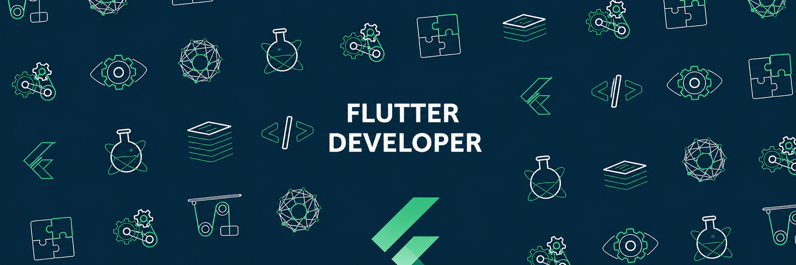

  

<h1 align="center">Hi 👋, I am Tanmay Chhipa</h1>
<h3 align="center">A Flutter Developer from Jaipur (India)</h3>
## 👨‍💻 About Me

I am a BCA student specializing in **Artificial Intelligence & Data Science**, with a strong focus on building real-world mobile applications using **Flutter**. I enjoy turning practical problems into clean, scalable solutions with intuitive UI/UX.

- 🚀 Currently building: Real-world Flutter apps with clean architecture & responsive UI  
- 📱 Strong in: Flutter, Dart, REST APIs, State Management (Provider)  
- 🔐 Experience with: Firebase Authentication, Hive (local storage), API integration  
- 🌱 Exploring: Advanced Flutter architecture, performance optimization, and scalable app design  
- ⚡ Fun fact: I prefer building apps that people can actually *use daily*  

---

## 💼 Professional Experience

| Period | Role | Company | Key Tech |
|--------|------|---------|----------|
| July 1 – July 31 | Frontend Developer | SkillCraft Technology | HTML, CSS, JavaScript |

---

## 🚀 Featured Projects

| Project | Description | Tech Stack |
|--------|------------|-----------|
| **DozyGo 😴📍** | Location-based alarm app that tracks real-time GPS and alerts users before reaching their destination using distance-based triggers and live routing | Flutter, Dart, OpenStreetMap, OSRM, Geolocator, APIs |
| **WeatherNow 🌦️** | Real-time weather app with hourly forecasts, API integration, and modern glassmorphism UI with smooth loading states | Flutter, Dart, REST API, HTTP, UI/UX |
| **ShopApp 👟** | Responsive e-commerce UI with product filtering, cart system, size selection, and state management using Provider architecture | Flutter, Dart, Provider, State Management |
| **ReTodo ✅** | Secure todo app with authentication and offline persistence, featuring real-time UI updates and local storage using Hive | Flutter, Firebase Auth, Hive, ValueListenableBuilder |

---

## 📊 Tech Stack

---

## 🎯 What I Focus On

- Building **production-level Flutter apps**
- Writing **clean, maintainable code**
- Designing **smooth and responsive UI**
- Working with **real APIs & data**
- Creating apps that solve **real-world problems**

---

⭐ *If you like my work, feel free to check out my repositories and connect!*  
